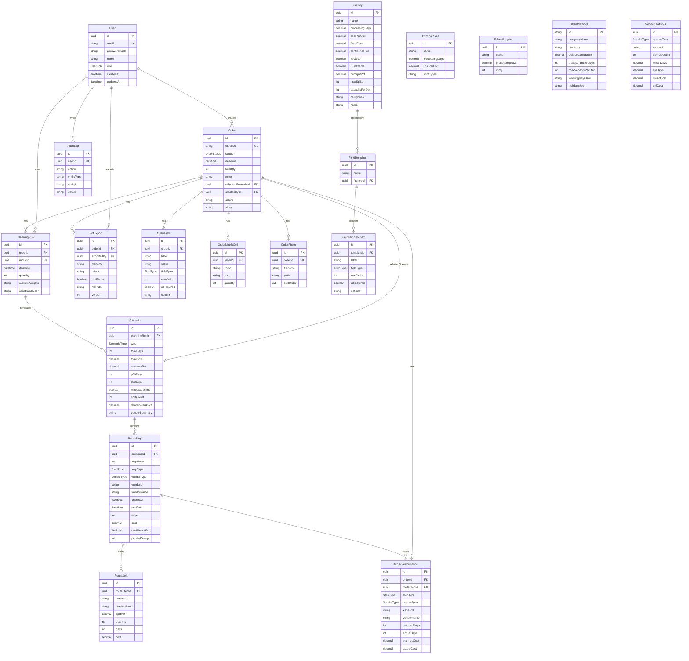

# Entity Relationship Diagram

## Enums

- **UserRole**: ADMIN, PLANNER, PRODUCTION_MANAGER, VIEWER
- **OrderStatus**: DRAFT → PLANNED → RELEASED → IN_PRODUCTION → COMPLETED → ARCHIVED
- **ScenarioType**: FASTEST_TIME, LOWEST_COST, BALANCED, MOST_RELIABLE, CUSTOM
- **StepType**: FABRIC, PRINT, FACTORY
- **VendorType**: FACTORY, PRINTING_PLACE, FABRIC_SUPPLIER
- **FieldType**: TEXT, DATE, NUMBER, TEXTAREA, DROPDOWN
